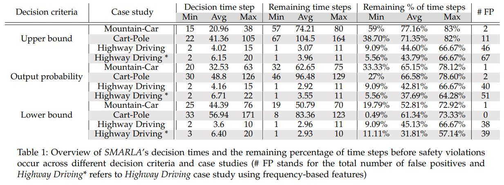

# SMARLA: A Safety Monitoring Approach for Deep Reinforcement Learning Agents
## Table of Contents
- [Introduction](#introduction)
- [Publication](#publication)
- [Description of the Approach](#description-of-the-approach)
- [Use cases](#use-case-1-cartpole)
  * [Use case 1](#use-case-1-cartpole)
  * [Use case 2](#use-case-2-mountain-car)
- [Code breakdown](#code-breakdown)
  * [Requirements](#requirements)
  * [Getting started](#getting-started)
  * [Repository Structure](#repository-structure)
  * [Dataset Structure](#dataset-structure)
- [Research Questions](#research-questions)
  * [RQ1](#rq1-how-accurately-and-early-can-we-predict-safety-violations-during-the-execution-of-episodes)
  * [RQ2](#rq2-how-can-the-safety-monitor-determine-when-to-trust-the-prediction-of-safety-violations)
  * [RQ3](#rq3-what-is-the-effect-of-the-abstraction-level-on-the-safety-monitoring-component)

## Introduction

In this project, we propose a Safety Monitoring Approach for Reinforcement Learning Agents (_SMARLA_).  
<!-- _SMARLA_ is a Safety Monitoring Approach for Reinforcement Learning Agents.  -->
_SMARLA_ is a black-box monitoring approach that uses machine learning to monitor the RL agent and predict the safety violations in DRL agents accurately and early on time. We leverage state abstraction methods~\cite{pmlr-v80-abel18a,jiang2018notes, li2006towards} to reduce the state space and thus increase the learnability of machine learning models to predict violations. We Implement SMARLA on to well-known RL benchmark problems known as Mountain-Car and Cart-Pole control problems.

<!-- This approach effectively searches for failing executions of the agent where we have a limited testing budget. To achieve this, we rely on machine learning models to guide our search and we use a dedicated genetic algorithm to narrow the search toward faulty episodes. These episodes are sequences of states and actions produced by the DRL agent. We apply STARLA on a DQN agent trained in a Cartpole environment for 50K time steps. -->

## Publication
This repository is a companion page for the following paper 
> "SMARLA: A Safety Monitoring Approach for Deep Reinforcement Learning Agents".

> Submitted to ICSE 2024 

## Description of the Approach

SMARLA is a safety monitoring system that is trained on episodes from the agent's execution. SMARLA is designed to predict safety violations as soon as possible and initiate safety mechanisms to prevent potential harm and damages. However, SMARLA can be used to (1) Identify any safety violation that may arise in uncertain and dynamic environments; (2) Provide insight into the decision-making and learning process; (3) Help to identify when retraining is required.
The detailed approach is depicted in the following diagram:

As depicted, the main objective of SMARLA is to predict safety violations as early as possible. The early detection of unsafe episodes is important for any safety-critical system to enable prompt corrective actions to be taken and thus prevent unsafe behavior of the agent. Our approach predicts such safety violations by monitoring the behavior of the RL agent and predicting unsafe episodes using a machine learning (ML) model based on the agent states. To train the ML model we randomly execute the RL agent and labeled the episodes as safe or unsafe. Due to the large size of the state space, we rely on state abstraction to reduce the state space and enhance the learnability of our ML model. Then the model monitors the behavior of the agent and estimates the probability of encountering an unsafe state while an episode is being executed. We rely on the confidence intervals of such probability to accurately determine the optimal time step to trigger safety mechanisms. 

Our approach can be best understood by drawing an analogy to how humans asses the risk before decision-making. In reinforcement learning (RL), the learning process is inspired by the way humans learn from their actions and their outcomes.
Similarly, our safety monitor functions like an observant, keeping an eye on the desirability and potential consequences of different actions taken by the agent in each state. Just as we evaluate the potential outcomes of our actions to make informed decisions, the safety monitor assesses the states and actions to predict the likelihood of safety violations if the execution is continued.

# Use cases

## Use Case 1: Cartpole

We use the Cartpole environment from the OpenAI Gym library[2] as the first case study. Cartpole environment is an open-source and widely used environment for RL agents.

In the Cart-Pole (also known as invert pendulum), a pole is attached to a cart, which moves along a track. The movement of the cart is bidirectional so the available actions are pushing the cart to the left and right. However, the movement of the cart is restricted and the maximum range is 2.4 from the central point. 
The pole starts upright, and the goal is to balance it by applying two discrete actions of (1) moving the cart to the left and (2) moving the cart to the right.

     

As depicted in the figure, the state of the system is characterized by four elements:

• The position of the cart.

• The velocity of the cart.

• The angle of the pole.

• The angular velocity of the pole.

A reward of +1 is considered for each time step when the pole is still upright. 
The episodes end in three cases: 
1. The cart is away from the center with a distance of more than 2.4 units
2. The pole’s angle is more than 12 degrees from vertical
3. The pole remains upright during 200 time steps.

- **safety violation:** An episode is considered unsafe if the cart moves away from the center with a distance above 2.4 units, regardless of the accumulated reward. In such a situation, the cart can pass the border and cause damage to other entities in the surroundings, which is therefore considered a safety violation.

## Use Case 2: Mountain Car

In the second case study, we have a DQN agent (implemented by stable baselines[1]) in the Mountain Car environment from the OpenAI Gym library[2]. The mountain car environment is an open-source and another widely used environment for RL agents

In the Mountain Car problem, an under-powered car is located in a valley between two hills. 
Since the gravity is stronger than the engine of the car, the car cannot climb up the steep slope even with full throttle. The objective is to control the car and strategically use its momentum to reach the goal state on top of the right hill as soon as possible. The agent is penalized by -1 for each time step until termination. 

     

The state of the agent is defined based on:

1. the location of the car along the x-axis.
2. the velocity of the car.

There are three discrete actions that can be used to control the car:

• Accelerate to the left.

• Accelerate to the right.

• Do not accelerate.

Episodes can have three termination scenarios: 

1. reaching the goal state,
2. crossing the left border, or 
3. exceeding the limit of 200 time steps.

- **Safety violation:** A safety violation is simulated by considering the crossing of the left border of the environment as an irrecoverable unsafe state that poses potential damage to the car. Consequently, when the car crosses the left border of the environment, it triggers a safety violation, leading to the termination of the episode. This modification allows us to assess the effectiveness of SMARLA in predicting safety violations.

## Code Breakdown
This project is implemented in Python with Jupyter-notebook.

In this replication package, we have two notebook files for each case study the first one is `SMARLA_{Case Study Name}.ipynb` which contains the implementation of the safety monitor. The second one `RQ_{Case Study Name}.ipynb` is the final step to reproduce the results to answer  RQ1 - RQ2 and RQ3. However, the description and the details of RQ3 are not presented in the paper due to space limitations. For this reason, we have explained RQ3 in detail here in our replication package.

`SMARLA_{Case Study Name}.ipynb` contains the implementation of SMARLA. Safety monitoring model and Abtraction data will be generated and stored as files. 

`RQ_{Case Study Name}.ipynb` transforms the episodes and analyzed the performance of the safety violation prediction model with different parameters, and generates plots and figures to answer RQs

The mountain-Car folder contains the implementation of SMARLA on the Mountain Car problem. Dataset and Result files follow the same structure as well. 

## Requirements

This project is implemented using the following Libraries:
 - stable-baselines==2.10.2
 - pymoo==0.4.2.2

To install dependencies: 
  - `!pip install stable-baselines==2.10.2`
  - `!pip install pymoo==0.4.2.2`

The code was developed and tested based on the following packages:

- python 3.7
- Tensorflow 1.15.2
- matplotlib 3.2.2
- sklearn 1.0.2
- gym 0.17.3
- numpy 1.21.6
- pandas 1.3.5
---------------

Here is the documentation on how to use this replication package.

### Getting Started

1. Clone the repo.
2. Download the Dataset of the replication package 
3. Update the path to the dataset in the scripts
4. Update the path for storing the results if needed
5. To build the safety monitoring model on Mountain-Car: open `SMARLA_MountainCar.ipynb` and run the code. Similarly for Cart-Pole `SMARLA_CartPole.ipynb`
6. To generate the final results open `RQ_{Case Study Name}.ipynb` and run the notebook step by step.

### Repository Structure

This is the root directory of the repository. The directory is structured as follows:

    Replication package of STARLA
     .
     |
     |Cart-Pole/                                  Cart-Pole use case
     |
     |---------- SMARLA_CartPole.ipynb            Implementation of the SMARLA on Cart-Pole problem
     |
     |---------- RQ_CartPole.ipynb                Codes to replicate RQ1 - RQ2 and RQ3
     |
     |
     |Mountain_Car/                               Mountain-Car use case
     |
     |---------- SMARLA_MountainCar.ipynb         Implementation of the SMARLA on Mountain-Car problem
     |
     |---------- RQ_MountainCar.ipynb             Codes to replicate RQ1 - RQ2 and RQ3    
     |
     |   
  
### Dataset Structure 

  A Dataset is provided to reproduce the results. This dataset contains our DRL agent, episodes of random testing of the agent, Abstraction files, and the safety monitoring models for each case study. Thus the dataset is divided into two parts:
  1. Cart-Pole 
  2. Mountain-Car
  
  below is the structure of the dataset:

    Dataset
     .
     |Cart-Pole/
     |
     |--- /Trained_agent/                                      Trained DQN agent 70k steps in Cart-Pole environment 
     |
     |--- /Random_episodes/                                    Random episodes generated for training and testing 
     |
     |--- /ABS/                                                Abstraction data     
     |
     |--- /ML_models/                                          ML based safety monitoring models
     |
     |
     |
     |Mountain-Car/
     |
     |--- /Trained_agent/                                      Trained DQN agent 90k steps in Mountain-Car environment 
     |
     |--- /Random_episodes/                                    Random episodes generated for training and testing 
     |
     |--- /Abstraction/                                        Abstraction data     
     |
     |--- /ML_models/                                          ML based safety monitoring models                 
     
----------------
     
  

# Research Questions

Our experimental evaluation answers the research questions below.

## RQ1. How accurately and early can we predict safety violations during the execution of episodes?

*This research question aims to investigate how accurately and early our approach can predict safety violations of the RL agent during its execution. Preferably, high accuracy should be reached as early as possible before the occurrence of safety violations to enable the effective activation of safety mechanisms.*

To answer this research question, we build a dataset of 1000 episodes generated by random executions. To build our ground truth, these episodes were labeled as either safe or unsafe, taking into account the presence or absence of safety violations in each episode. 
We monitored the execution of each episode with SMARLA and at each time step. When the upper bound of the confidence interval is greater than 50% during the execution of the episode, SMARLA classifies the episode as unsafe. For each case study, we computed the number of successfully predicted safety violations, and measured the prediction precision, recall, and F1-score at each time step, over the set of episodes. Results are presented in the following figures.

   
 

 

   Number of detected functional faults in the Cartpole case study

     

   Number of detected functional faults in the Mountain Car case study

**Answer:** SMARLA demonstrated high accuracy in predicting safety violations from RL agents. Moreover, such accurate predictions can be obtained early during the execution of episodes, thus enabling the system to prevent or mitigate damages. 

## RQ2. How can the safety monitor determine when to trust the prediction of safety violations?
*In this research question, we investigate the use of confidence intervals as a mechanism for the safety monitor to determine the appropriate time step to trigger safety mechanisms.*

This investigation is based on the same set of episodes randomly generated for RQ1. At each time step $t$, we collect the predicted probability of safety violation $P_{e_i}(t)$ and the corresponding confidence interval $[Low(t),Up(t)]$. The lower bound ($Low(t)$) and upper bound($Up(t)$) of the confidence interval are computed using the methodology detailed in the approach section in the paper. 

To determine the best decision criterion for triggering safety mechanisms, we considered and compared the following alternative criteria:
- If the probability of safety violation, $P_{e_i}(t)$, is equal to or greater than 50\%, then the safety mechanism is activated.
- If the upper bound of the confidence interval at time step $t$ (based on the confidence level of 95\%) is above 50\% (i.e., $Up(t) \geq 50\%$), then the safety mechanism is activated. This is a conservative approach as the actual probability has a 97.5\% chance to be below that value. This may result in many false positives but it leads to early predictions of unsafe episodes and is unlikely to miss any unsafe episodes.
- If the lower bound of the confidence intervals at time step $t$ is above 50\% (i.e., $Low(t) \geq 50\%$), then the safety mechanism is activated. In this criterion, the actual probability has only a 2.5\% chance to be below that bound and we thus minimize the occurrence of false positives, at the cost of relatively late detection of unsafe episodes and more false negatives. 

Decision criteria identify the time step when the execution should be stopped and safety mechanisms should be activated. However, note that during our test, we continue the execution of the episodes until termination in order to extract the number of time steps until termination and the true label of episodes for our analysis. 

**How do the predictions based on the three above criteria compare in terms of accuracy.** Figures below present a comparison of the F1-scores of the three predictions at each time step for both case studies. 

   
 

 

   Number of detected functional faults in the Cartpole case study

     

   Number of detected functional faults in the Mountain Car case study

Though there are differences in the magnitude of the trend, results from our case studies consistently show that using the upper bound is the best choice as it leads to early accurate predictions. 

We computed the average improvements, in terms of time steps required to achieve peak performance, when predicting safety violations by considering the upper bound of the confidence interval, in contrast to (1) the output probability and (2) the lower bound of the confidence interval. 
Our findings indicate that using the upper bound of the confidence intervals results in an average improvement of 17\% for Cart-Pole and 10\% for Mountain-Car, in terms of prediction time for safety violations, as compared to using the predicted probability. When compared to using the lower bound, the improvement is 25\% for Cart-Pole and 28\% for Mountain-Car.

We also investigated in both case studies three important metrics: (1) the decision time step, (2) the remaining time steps until the occurrence of a safety violation, and (3) the remaining percentage of time steps to execute until violation. For each metric, we present in the Table below the minimum, maximum, and average values.

     

To summarize, while relying on the upper bound of confidence intervals leads to an earlier prediction of safety violations, it also introduces a higher rate of false positives compared to using the predicted probability and the lower bound. Therefore, considering the trade-off between earlier detection of safety violations and the number of false positives, the selection of an appropriate decision criterion relies heavily on the level of criticality of the RL agent. For instance, in certain scenarios, prioritizing early detection of safety violations and allowing for a longer time frame to apply safety mechanisms may be of critical importance, even at the expense of a slightly higher false positive rate. Conversely, in other cases, there might be a preference to sacrifice time in order to optimize accuracy and minimize the occurrence of false positives. The selection of the appropriate decision criterion depends on the specific context and the relative importance of early detection and prediction accuracy. In our case studies, the increase in false positives appears to be limited, and therefore using the upper bound is the best option. 

**Answer:** Considering the upper bound of the confidence intervals leads to a significantly earlier and still highly accurate detection of safety violations. This provides a longer time frame for the system to apply preventive safety measures and mitigate potential damages. This, however, comes at the expense of a slightly higher false positive rate.

## RQ3. What is the effect of the abstraction level on the safety monitoring component?

*We aim in this research question to investigate if and how different levels of state abstraction affect the safety violation prediction capabilities of the model. Specifically, we want to study the impact of state abstraction levels on (1) the accuracy of the safety violation prediction model after training, and (2) the accuracy of the ML model in operation.
Our goal is to gain insights into the possible trade-offs between the size of the feature space and the granularity of information captured by features, both determined by the abstraction level. Such an analysis aims to provide guidance in selecting proper abstraction levels in practice.*

To answer this research question, we studied how different levels of state abstraction affect the performance of the safety violation prediction model in the training phase and in operation.

**The accuracy of the Random Forest model after training with different abstraction levels.** This aspect involves evaluating the performance of the Random Forest model once it has been trained on the available training data. To build our dataset, we sampled 2200 episodes through random execution of the RL agent, including 215 unsafe episodes for Cart-Pole and 279 unsafe episodes for Mountain-Car. We randomly sampled 70% of the dataset to train and 30% to compute the F1-scores of the models using different levels of abstraction $d$.

A lower abstraction level implies finer-grained states, while higher abstraction levels represent coarser ones that lead to a smaller feature space.

Based on the analysis, we observed that higher abstraction levels lead to lower accuracy in predicting safety violations, above a threshold of 0.3 for Cart-Pole and 1000 for Mountain-Car. This is attributed to the smaller feature space associated with higher levels of abstraction. As the abstraction level decreases, the feature space grows larger, allowing for more precise information to be captured by features. Consequently, the accuracy of the safety violation prediction model tends to increase until it eventually plateaus and then starts to decrease. This decrease occurs due to the very large number of abstract states, making it more challenging to learn in a larger feature space.
This suggests that there is an optimal range of abstraction that yields the highest accuracy in predicting safety violations. Going beyond this optimal range can reduce the performance of safety monitoring. This optimal range of abstraction level depends on the environment, the RL agent, and the reward. This arises from the fact that the calculation of Q-values, which are used in the abstraction process, relies heavily on the reward signal. Consequently, the choice of reward function significantly influences the optimal range of abstraction levels.
Indeed, our empirical analysis revealed that abstraction levels ranging from 0.1 to 0.3 result in the highest accuracy for Cart-Pole while for Mountain-Car,  abstraction levels from 0.5 to 1000 result in the highest accuracy. Therefore, for the next experiments, we consider the abstraction levels within the optimal ranges of each case study. 

<!-- 

     

 -->

     

   Accuracy of the fault detection rules in the Cartpole case study

   
 

 

   Accuracy of the fault detection rulesin the Mountain Car case study

**The performance of the model in operation with different abstraction levels.** This part focuses on evaluating the performance of the safety violation prediction model during the execution of episodes. We analyze how well the trained _Random Forest_ models perform in operation across different time steps while considering different abstraction levels.
The main focus for such evaluation is the model's ability to accurately predict safety violations early. 

The F1-score of the _Random Forest_ models for the two case studies, considering various levels of abstraction, are presented in the Figures below: 

     

     

As visible, the performance of the safety violation prediction model is highly sensitive to the selected abstraction level during the training phase, especially in the case of Mountain-Car. Despite selecting only abstraction levels that maximize the model's performance during training, they required different numbers of time steps to achieve the highest accuracy in predicting safety violations. This sensitivity highlights the importance of carefully selecting the appropriate abstraction level for optimal model performance.

Based on the Figures, we observe that the most suitable abstraction level is $d=0.11$ for _Cart-Pole_  and  $d=5$ for _Mountain-Car_, as they exhibit the most accurate and earliest prediction of safety violations compared to other abstraction levels. 
This indicates that these abstraction levels are particularly effective at capturing relevant features at the right level of granularity to support learning and the prediction of  unsafe episodes. 

To select the best abstraction level in practice, for a given RL agent, we recommend training the safety violation prediction model with different levels of abstraction and then identifying the optimal range which corresponds to the highest F1-score after training, as described in the first part of this research question. Abstraction levels can be mapped to numbers of abstract states and this can be used to determine the abstraction level range to be explored. As a rule of thumb, to make this procedure more practical, we recommend to cover the range going from a few hundred states to around 100,000 states. However, this range is dependent on the complexity of the environment, where a more complex environment may require a larger number of abstract states to be able to accurately predict safety violations. 

Within the optimal range, we further analyze the time steps at which the safety monitor reaches its peak performance in operation. Therefore, we should try different abstraction levels within the optimal range when using the safety violation prediction model during the execution of episodes. The goal is to identify the level of abstraction that enables the safety monitor to reach its highest performance in predicting safety violations at the earliest time step possible. 

**Answer:** The accuracy of safety violation prediction models is sensitive to the selected abstraction level and, therefore, the latter should be carefully selected following the proposed procedure.

References
-----
1- [stable-baselines](https://github.com/hill-a/stable-baselines)

2- [gym](https://github.com/openai/gym)

